# AutoGLM-Aura

[](https://opensource.org/licenses/Apache-2.0)
[](https://developer.android.com)
[](https://kotlinlang.org)
[](https://shizuku.rikka.app/)

<div align="center">

**Native Android Client for Open-AutoGLM**

Run AI Assistants directly on your phone, no PC required.

[English](README.md) | [中文](README_CN.md)

> This is an independent Android implementation and is not an official Open-AutoGLM client.

</div>

## Introduction

AutoGLM-Aura is a native Android implementation of the [Open-AutoGLM](https://github.com/zai-org/Open-AutoGLM) project. Unlike the original project which controls the phone via ADB from a PC, AutoGLM-Aura is a complete Android application that runs independently on your device.

**Key Features:**
- 🤖 **Native Android App** - Runs directly on the phone, no PC needed.
- 🎤 **Voice Control** - Supports voice commands for tasks.
- 📱 **Automated Actions** - Controls apps via Accessibility Service.
- 🚀 **Advanced Mode (Shizuku)** - Binder-level interaction with system permissions for higher performance and reliability.
- 📺 **Virtual Screen Execution** - Runs tasks on a background virtual display, allowing you to use your phone normally while the agent works.
- 🧠 **Dual Execution Modes**:
    - **Turbo Mode**: Single model fast execution for simple tasks.
    - **Deep Mode**: Orchestrator + Worker dual-model collaboration for complex tasks.
- 🔒 **Secure Storage** - API keys and configurations are encrypted using Android's EncryptedSharedPreferences.
- 🌐 **Flexible API** - Compatible with any OpenAI-format API, including self-hosted models (e.g., Ollama, vLLM) and third-party services (e.g., Zhipu, DeepSeek).
- ✨ **Native Text Injection** - Injects text directly via Accessibility Service without requiring ADB Keyboard or IME switching.

### 🧠 Turbo vs Deep Mode

| Feature | ⚡ Turbo Mode | 🧠 Deep Mode |
|---|---|---|
| **Model** | Single Model | Orchestrator + Worker (Dual) |
| **Speed** | Fast (1-2s/step) | Thoughtful (3-5s/step) |
| **Planning** | Implicit | Explicit step-by-step plan |
| **Best For** | Simple tasks (e.g., "Open Settings") | Complex multi-step tasks (e.g., "Order a latte under $30") |
| **Review** | None | Async review after every 3 steps |
| **Timeout Resilience** | N/A | Auto-advances on timeout if worker reports completion |

### 🏛️ Architecture

```mermaid
flowchart LR
    subgraph User Interface
        A[🎤 Voice / Text Input]
    end

    subgraph AgentCore
        B[Sherpa-ONNX] --> C[AgentRepository]
        C --> D{Mode?}
        D -->|Turbo| E[Single Model Loop]
        D -->|Deep| F[DualModelAgent]
        F --> G[Orchestrator - Plan & Review]
        F --> H[VisionWorker - Execute]
    end

    subgraph AI Backend
        E --> I[LLM API]
        G --> I
        H --> J[Vision Model API]
    end

    subgraph Execution Layer
        I --> K[FallbackActionExecutor]
        J --> K
        K --> L{Shizuku Available?}
        L -->|Yes| M[Shizuku Service - Binder Injection]
        L -->|No| N[Accessibility Service]
        M --> O[📱 Android UI]
        N --> O
    end
```



## Demo

<div align="center">
  
  
  
</div>

Simply:
1. Enable Accessibility Service.
2. Configure your AI Model API address.
3. Input a task via voice or text (e.g., "Open TikTok and search for dance videos").
4. The AI completes the entire operation automatically.

## Tech Stack

### Architecture
- **UI**: Jetpack Compose + Material 3
- **Architecture**: MVVM + Repository Pattern
- **DI**: Hilt (Dagger)
- **Network**: Retrofit + OkHttp
- **Storage**: EncryptedSharedPreferences
- **Voice**: Sherpa-ONNX (Offline High-Accuracy Recognition)
    - Model: Paraformer 2024-03-09
    - Accuracy > 90%
- **Kotlin**: 1.9.x
- **Min SDK**: 26 (Android 7.0+)
- **Target SDK**: 34

### Core Components

#### 1. AutoAgentService (Accessibility & Shizuku)
Location: `app/src/main/java/com/autoglm/autoagent/service/AutoAgentService.kt`
Location: `app/src/main/java/com/autoglm/autoagent/shell/AutoGLM-AuraUserService.kt`

The core services for automation:
- **Accessibility Service**: Used for UI tree analysis and basic gestures.
- **Advanced Shizuku Service**: Binder-level interaction for high-performance input injection and virtual display management.
- **Virtual Display**: Allows background task execution without主屏幕 (main screen) interference.

```kotlin
// Main Functions
- click(x, y)          // Click
- longPress(x, y)      // Long Press
- scroll(x1, y1, x2, y2) // Scroll
- takeScreenshotAsync() // Screenshot
```

#### 2. AIClient (AI Communication)
Location: `app/src/main/java/com/autoglm/autoagent/data/api/AIClient.kt`

Communicates with AI Model Services:
- Compatible with OpenAI Chat Completions API format.
- Supports Multimodal Input (Text + Image).
- Configurable Base URL, API Key, Model.

```kotlin
// API Parameters
temperature: 0.0        // Strict Mode
top_p: 0.85
frequency_penalty: 0.2
max_tokens: 3000
```

#### 3. Agent Orchestration (Turbo vs Deep Mode)
Location: `app/src/main/java/com/autoglm/autoagent/data/AgentRepository.kt`
Location: `app/src/main/java/com/autoglm/autoagent/agent/DualModelAgent.kt`

Coordinates task execution:
- **Turbo Mode**: Fast single-model execution loop (Screenshot → AI → Action).
- **Deep Mode**: Dual-model orchestration where a "Large Model" plans and reviews, while a "Small Model" executes specific steps.
- **State Management**: Handles Virtual Display lifecycle and task persistence.

## Setup Guide

### 1. Installation
Install AutoGLM-Aura.apk (approx. 100 MB).

### 2. Permissions & Services
AutoGLM-Aura works best with two complementary services:
1. **Accessibility Service** (Required for basic automation)
   - Enable "AutoAgent Service" in system settings.
2. **Shizuku Service** (Required for Advanced Mode)
   - Install **Shizuku** and activate it via Wireless Debugging or Root.
   - Authorize AutoGLM-Aura in the Shizuku app.
3. **Other Permissions**
   - Overlay/Floating Window (for controls).
   - Display/Screen Recording (for background Virtual Display).
   - Microphone (Voice commands).

### 3. API Configuration
Go to Settings and enter your model API information.

**Example (Zhipu AI):**
- Base URL: `https://open.bigmodel.cn/api/paas/v4`
- Model: `GLM-4.6V-Flash`
- API Key: `Your API Key`

## Limitations

1. **Secure Content**
   - Banking or highly secure apps may still block screenshots via `FLAG_SECURE`, even in Virtual Display mode.
2. **Resource Usage**
   - Running a background Virtual Display with AI inference requires a device with decent RAM (8GB+ recommended).
3. **OS Consistency**
   - While Virtual Display works on Android 7.0+, stability is significantly better on Android 11+ (especially for input injection).

## ⚠️ Compatibility & Disclaimer

Due to individual development with limited equipment and time, the project has only been tested on:
- **Xiaomi**: Android 14 (HyperOS)
- **Google Pixel**: Android 16 (Preview)

**If you encounter any bugs, please submit a [GitHub Issue](https://github.com/aellnxin/AutoGLM-Aura/issues) or email [aellnxin@gmail.com](mailto:aellnxin@gmail.com)**

## Roadmap

- [x] ~~Online Voice Recognition~~ - Upgraded to Sherpa-ONNX (Offline)
- [x] **Advanced Mode** - Shizuku integration & Virtual Screen background execution
- [x] **Dual Model Architecture** - Turbo (Fast) and Deep (Reasoning) modes
- [x] **UI Polish & Animations** - Premium Glassmorphism design
- [ ] Task History
- [ ] Custom Shortcuts
- [x] Performance & Stability Improvements (Shizuku Binder Bridge)
- [ ] Multi-language Support (In-App)
- [ ] Virtual Screen Floating Window (Preview background tasks)
- [ ] Voice Wake-up (Hotword detection)

## Third-party Components and Referenced Projects

This project uses the following open-source components or references:

- **Open-AutoGLM** (Apache License 2.0) - Automation agent design and protocol reference
- **Sherpa-ONNX** (Apache 2.0) - Offline Speech Recognition Engine
- **Paraformer Model** (Apache 2.0) - Chinese Speech Recognition Model
- **AutoGLM-Phone-9B family** (See original model license) - Large language model used via API
- **Shizuku** (Apache 2.0) - System-level ADB service

See [Third Party Licenses](./THIRD_PARTY_LICENSES.md) for details.

## Disclaimer

⚠️ **Disclaimer**: This project is for research and learning purposes only. It is strictly prohibited for any illegal use.

---

**Developer**: Aell Xin
**Email**: aellnxin@gmail.com
**Last Updated**: 2026-01-07
