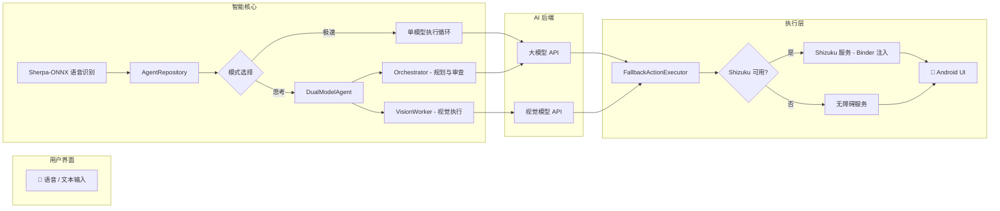

[English Version](README.md)

# AutoGLM-Aura

[](https://opensource.org/licenses/Apache-2.0)
[](https://developer.android.com)
[](https://kotlinlang.org)
[](https://shizuku.rikka.app/)

<div align="center">

**Open-AutoGLM 的 Android 原生客户端**

让 AI 智能助理直接在手机上运行,无需电脑辅助

> 本项目为社区个人独立实现

</div>

## 简介

AutoGLM-Aura 是 [Open-AutoGLM](https://github.com/zai-org/Open-AutoGLM) 项目的 Android 原生实现。与原项目通过 PC 端 ADB 控制手机不同，AutoGLM-Aura 是一个完全独立运行在设备上的 Android 应用程序。

**核心特性:**
- 🤖 **原生 Android 应用** - 直接在手机运行，无需 PC。
- 🎤 **语音控制** - 支持语音指令发布任务。
- 📱 **自动化操作** - 通过无障碍服务（Accessibility Service）控制应用。
- 🚀 **高级模式 (Shizuku)** - 基于 Binder 桥接的系统级控制，响应更快，权限更高。
- 📺 **后台隔离运行** - 支持通过虚拟屏幕在后台执行任务，主屏操作不受干扰。
- 🧠 **双模型执行模式**:
    - **极速模式 (Turbo)**: 单模型快速响应，适合简单直接的任务。
    - **思考模式 (Deep)**: 大模型规划 + 小模型执行，双模型协作攻克复杂任务。
- 🔒 **安全存储** - API 配置经过加密处理。
- 🌐 **自定义 API** - 支持自托管或第三方 AI 服务。
- ✨ **直接注入** - 通过原生无障碍服务注入文本，无需切换输入法。

### 🧠 极速 vs 思考模式对比

| 特性 | ⚡ 极速模式 (Turbo)          | 🧠 思考模式 (Deep)                      |
|---|-------------------------|-------------------------------------|
| **模型** | 单一模型                    | 大模型 + 小模型 (双模型协作)                   |
| **速度** | 极快            | 深思熟虑                      |
| **规划** | 隐式推断                    | 显式分步计划                              |
| **适用场景** | 简单任务 (如 "美团点一杯30元以下的拿铁") | 复杂多步任务 (如 "美图饿了么点一杯拿铁对比价格找到性价比的购买") |
| **审查机制** | 无                       | 每3步异步审查                             |
| **超时容错** | 不适用                     | 超时后若小模型已完成则自动推进                     |

### 🏛️ 系统架构



## 演示

<div align="center">
  
  
  
</div>

简单几步:
1. 开启无障碍服务。
2. 配置您的 AI 模型 API 地址。
3. 通过语音或文本输入任务 (例如: "打开抖音搜索舞蹈视频")。
4. AI 将自动完成整个操作流程。

## 技术栈

### 架构
- **UI**: Jetpack Compose + Material 3
- **架构**: MVVM + Repository Pattern
- **依赖注入**: Hilt (Dagger)
- **网络**: Retrofit + OkHttp
- **存储**: EncryptedSharedPreferences
- **语音**: Sherpa-ONNX (离线高精度识别)
    - 模型: Paraformer 2024-03-09
    - 准确率 > 90%
- **Kotlin**: 1.9.x
- **Min SDK**: 26 (Android 7.0+)
- **Target SDK**: 34

### 核心组件

#### 1. AutoAgentService (无障碍与 Shizuku)
位置: `app/src/main/java/com/autoglm/autoagent/service/AutoAgentService.kt`
位置: `app/src/main/java/com/autoglm/autoagent/shell/AutoGLM-AuraUserService.kt`

自动化的核心服务:
- **无障碍服务**: 用于 UI 树分析和基础手势。
- **高级 Shizuku 服务**: 基于 Binder 桥接的系统级交互，支持高频点击注入和虚拟屏幕管理。
- **后台隔离**: 通过创建虚拟屏幕，支持在不占用用户主屏幕的情况下执行任务。

```kotlin
// 主要函数
- click(x, y)          // 点击
- longPress(x, y)      // 长按
- scroll(x1, y1, x2, y2) // 滑动
- takeScreenshotAsync() // 截图
```

#### 2. AIClient (AI 通信)
位置: `app/src/main/java/com/autoglm/autoagent/data/api/AIClient.kt`

与 AI 模型服务通信:
- 兼容 OpenAI Chat Completions API 格式。
- 需支持多模态输入 (文本 + 图片)。
- 可配置 Base URL, API Key, 模型。

```kotlin
// API 参数
temperature: 0.0        // 严格模式
top_p: 0.85
frequency_penalty: 0.2
max_tokens: 3000
```

#### 3. Agent 调度 (极速与思考模式)
位置: `app/src/main/java/com/autoglm/autoagent/data/AgentRepository.kt`
位置: `app/src/main/java/com/autoglm/autoagent/agent/DualModelAgent.kt`

协调任务执行流程:
- **极速模式 (Turbo)**: 单模型快速执行循环（截图 → AI → 执行）。
- **思考模式 (Deep)**: 双模型调度架构，“大模型”负责逻辑规划与审查，“小模型”负责具体步骤执行。
- **虚拟化管理**: 自动管理虚拟屏幕的生命周期及后台任务保活。

## 快速开始

### 1. 安装
下载并安装最新 Release 版本 (`.apk`)，体积约 100 MB。

### 2. 权限授予
1. **无障碍服务**
   - 打开 AutoGLM-Aura，点击 "开启无障碍服务"。
   - 在系统设置中找到并开启 "AutoAgent Service"。
2. **其他权限**
   - 麦克风 (语音输入)
   - 网络 (AI 通信)

### 3. API 配置
进入设置页面配置您的模型 API 信息。

**示例 (智谱 AI):**
- Base URL: `https://open.bigmodel.cn/api/paas/v4`
- 模型: `GLM-4.6V-Flash`
- API Key: `您的 API Key`

## 限制

1. **安全应用限制**
   - 银行、支付类应用若设置了 `FLAG_SECURE`，即便在虚拟屏幕中仍可能捕获到黑屏。
2. **硬件性能需求**
   - 运行后台虚拟屏幕结合 AI 推理对内存有一定要求，建议 8GB RAM 以上机型。
3. **系统版本差异**
   - 虽然支持 Android 7.0+，但在 Android 11+ 上虚拟屏幕的稳定性与输入注入速度最佳。

## ⚠️ 兼容性说明

个人开发，设备和时间有限，目前仅在以下环境进行了测试：
- **Xiaomi (小米)**: Android 14 (HyperOS)
- **Google Pixel**: Android 16 (Preview)

**如有 Bug 请提交 [GitHub Issues](https://github.com/aellnxin/AutoGLM-Aura/issues) 或发送邮件至 [aellnxin@gmail.com](mailto:aellnxin@gmail.com)**

## 路线图

- [x] **离线语音识别** - 升级为 Sherpa-ONNX (离线)
- [x] **高级模式** - 集成 Shizuku 与虚拟屏幕后台执行
- [x] **双模型架构** - 支持极速 (Turbo) 与思考 (Deep) 双模式
- [x] **虚拟屏幕** - 支持通过虚拟屏幕在后台执行任务，主屏操作不受干扰
- [x] **任务历史记录** - 保留最近3次任务详情 
- [ ] 自定义快捷指令
- [x] **UI 优化与动画**
- [x] **性能与稳定性优化** (基于 Shizuku Binder 桥接)
- [ ] 多语言支持 (应用内)
- [ ] 增加虚拟屏幕的浮窗
- [ ] 语音唤醒

## 第三方组件与参考项目

本项目使用了以下开源组件或参考了相关设计:

- **Open-AutoGLM** (Apache License 2.0) - 自动化 Agent 设计与协议参考
- **Sherpa-ONNX** (Apache 2.0) - 离线语音识别引擎
- **Paraformer 模型** (Apache 2.0) - 中文语音识别模型
- **AutoGLM-Phone-9B family** (See original model license) - 通过 API 使用的大语言模型
- **Shizuku** (Apache 2.0) - 系统级adb服务

详见 [第三方组件许可](./THIRD_PARTY_LICENSES.md)

## 免责声明

⚠️ **免责声明**: 本项目仅供研究和学习使用,严禁用于任何非法用途。

---

**开发者**: Aell Xin
**邮箱**: aellnxin@gmail.com
**最后更新**: 2026-01-07
