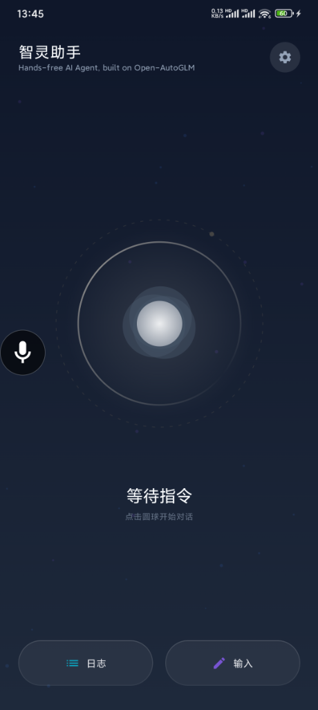
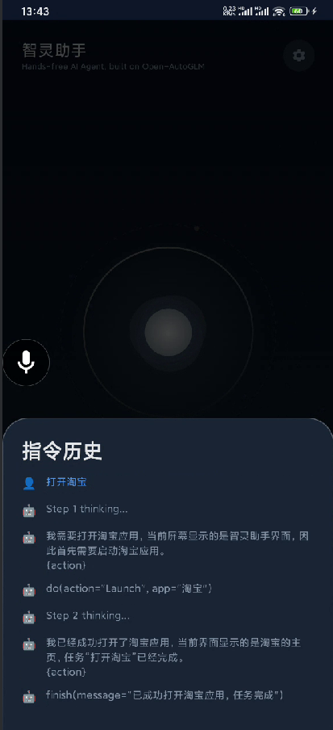
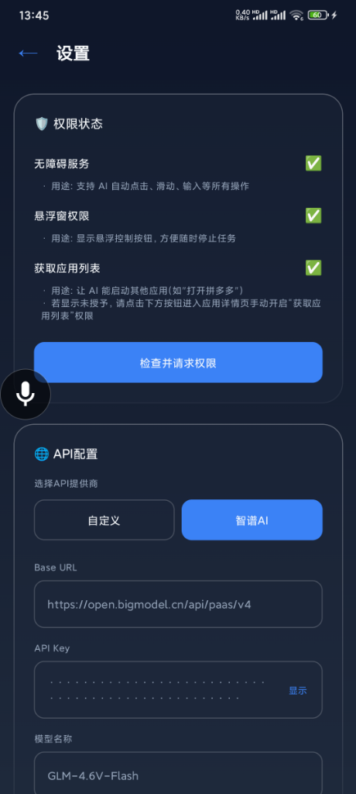

[English Version](README.md)

# AutoDroid

<div align="center">

**Open-AutoGLM 的 Android 原生客户端**

让 AI 智能助理直接在手机上运行,无需电脑辅助

> 本项目为社区独立实现，非 Open-AutoGLM 官方客户端。

</div>

## 简介

AutoDroid 是 [Open-AutoGLM](https://github.com/zai-org/Open-AutoGLM) 项目的 Android 原生实现。与原项目通过 PC 端 ADB 控制手机不同，AutoDroid 是一个完全独立运行在设备上的 Android 应用程序。

**核心特性:**
- 🤖 **原生 Android 应用** - 直接在手机运行，无需 PC。
- 🎤 **语音控制** - 支持语音指令发布任务。
- 📱 **自动化操作** - 通过无障碍服务（Accessibility Service）控制应用。
- 🔒 **安全存储** - API 配置经过加密处理。
- 🌐 **自定义 API** - 支持自托管或第三方 AI 服务。
- ✨ **直接注入** - 通过原生无障碍服务注入文本，无需切换输入法。

## 演示

<div align="center">
  
  
  
</div>

简单几步:
1. 开启无障碍服务。
2. 配置您的 AI 模型 API 地址。
3. 通过语音或文本输入任务 (例如: "打开抖音搜索舞蹈视频")。
4. AI 将自动完成整个操作流程。

## 技术栈

### 架构
- **UI**: Jetpack Compose + Material 3
- **架构**: MVVM + Repository Pattern
- **依赖注入**: Hilt (Dagger)
- **网络**: Retrofit + OkHttp
- **存储**: EncryptedSharedPreferences
- **语音**: Sherpa-ONNX (离线高精度识别)
    - 模型: Paraformer 2024-03-09
    - 准确率 > 90%
- **Kotlin**: 1.9.x
- **Min SDK**: 26 (Android 7.0+)
- **Target SDK**: 34

### 核心组件

#### 1. AutoAgentService (无障碍服务)
位置: `app/src/main/java/com/autoglm/autoagent/service/AutoAgentService.kt`

自动化的核心服务:
- 屏幕截取与 UI 树分析。
- 手势操作: 点击, 长按, 滑动。
- 文本输入: 通过无障碍 API 直接注入。

```kotlin
// 主要函数
- click(x, y)          // 点击
- longPress(x, y)      // 长按
- scroll(x1, y1, x2, y2) // 滑动
- takeScreenshotAsync() // 截图
```

#### 2. AIClient (AI 通信)
位置: `app/src/main/java/com/autoglm/autoagent/data/api/AIClient.kt`

与 AI 模型服务通信:
- 兼容 OpenAI Chat Completions API 格式。
- 支持多模态输入 (文本 + 图片)。
- 可配置 Base URL, API Key, 模型。

```kotlin
// API 参数
temperature: 0.0        // 严格模式
top_p: 0.85
frequency_penalty: 0.2
max_tokens: 3000
```

#### 3. AgentRepository (业务逻辑)
位置: `app/src/main/java/com/autoglm/autoagent/data/AgentRepository.kt`

协调任务执行流程:
- 管理对话历史。
- 执行循环: 截图 → AI 推理 → 原生执行。
- 状态与日志管理。

## 快速开始

### 1. 安装
下载并安装最新 Release 版本 (`.apk`)，体积约 100 MB。

### 2. 权限授予
1. **无障碍服务**
   - 打开 AutoDroid，点击 "开启无障碍服务"。
   - 在系统设置中找到并开启 "AutoAgent Service"。
2. **其他权限**
   - 麦克风 (语音输入)
   - 网络 (AI 通信)

### 3. API 配置
进入设置页面配置您的模型 API 信息。

**示例 (智谱 AI):**
- Base URL: `https://open.bigmodel.cn/api/paas/v4`
- 模型: `GLM-4.6V-Flash`
- API Key: `您的 API Key`

## 对比

| 特性 | Open-AutoGLM (原版) | AutoDroid (本项目) |
|---|---|---|
| **运行环境** | PC 控制手机 (ADB) | 手机直接运行 (原生) |
| **输入方式** | CLI 或 Python API | 语音 / 文本 UI |
| **复杂度** | 需配置 Python & ADB | 仅安装 APK |
| **截图** | ADB screencap 命令 | 无障碍服务 API |
| **执行** | ADB input 命令 | 无障碍手势 + 原生文本注入 |
| **场景** | 开发/测试, 批量任务 | 日常个人使用 |

## 限制

1. **无障碍限制**
   - 部分系统或安全应用可能限制无障碍访问。
2. **截图限制**
   - 银行/支付类应用可能禁止截图 (黑屏)。
3. **APK 体积**
   - 约 100 MB (包含离线语音模型)。
4. **系统版本**
   - 需要 Android 7.0+。

## 路线图

- [x] ~~在线语音识别~~ - 升级为 Sherpa-ONNX (离线)
- [ ] 任务历史记录
- [ ] 自定义快捷指令
- [ ] UI 优化与动画
- [ ] 多语言支持
- [ ] 性能与稳定性优化

## 第三方组件与参考项目

本项目使用了以下开源组件或参考了相关设计:

- **Open-AutoGLM** (Apache License 2.0) - 自动化 Agent 设计与协议参考
- **Sherpa-ONNX** (Apache 2.0) - 离线语音识别引擎
- **Paraformer 模型** (Apache 2.0) - 中文语音识别模型
- **AutoGLM-Phone-9B family** (See original model license) - 通过 API 使用的大语言模型

详见 [第三方组件许可](./THIRD_PARTY_LICENSES.md)

## 免责声明

⚠️ **免责声明**: 本项目仅供研究和学习使用,严禁用于任何非法用途。

---

**开发者**: Aell Xin
**最后更新**: 2026-01-03
